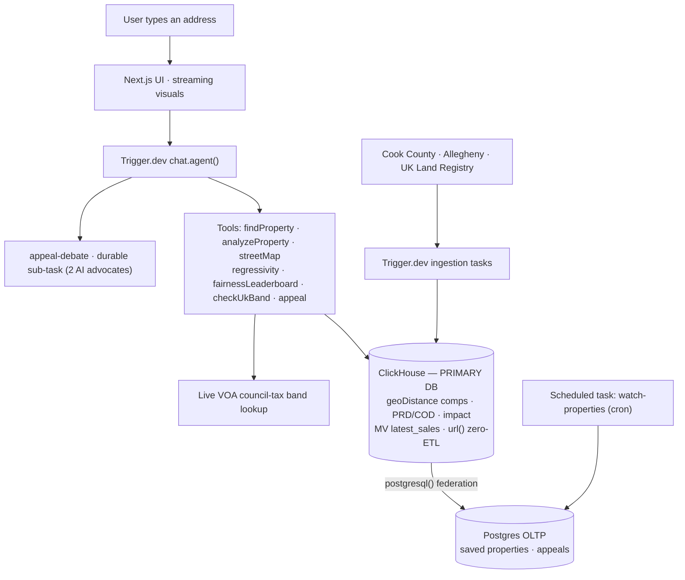

# Overtaxed

**Type your home address. Instead of a paragraph, see a map of your street proving you're taxed too high, a one-line "you're overpaying $X/yr" verdict, and a pre-filled appeal — plus the map showing the poor are overtaxed to subsidise the rich.**

Built for the **ClickHouse × Trigger.dev Virtual Summer Hackathon 2026** — theme *"Beyond the Wall of Text."*

> ⚠️ Estimates from public records. Not tax or legal advice.

---

## Why it exists

30–60% of US homes are over-assessed and 400,000+ UK homes sit in the wrong council-tax band (still on 1991 "drive-by" valuations) — yet **fewer than 1 in 20 people ever challenge it**, and successful appeals save **$1,000–3,000 / £thousands a year**. The prices are public; nobody could *query* them. Overtaxed makes your street answerable in milliseconds.

## The stack (both tools are load-bearing)

| Layer | Tech | Role |
|---|---|---|
| Primary database | **ClickHouse Cloud** | 6M+ UK sales + 1.6M US parcels; live `geoDistance` comps, IAAO sales-ratio science (PRD/COD), sub-second regressivity aggregation |
| Orchestration | **Trigger.dev `chat.agent()`** | the agent loop + durable long-running ingestion tasks + appeal generation |
| OLTP (bonus) | **ClickHouse Cloud Postgres** | saved properties & appeals, joined live into ClickHouse via `postgresql()` |
| Frontend | **Next.js · MapLibre GL · Recharts** | the response *is* a map / chart / interactive component |
| Agent brain | **Claude (Anthropic)** via AI SDK | tool routing + one-sentence narration |

## Data actually loaded (all real, all live)

- **US — two counties:** **Cook County** (Chicago) — ~1.59M residential **parcels** (geo + address), ~1.59M **assessments**, ~69k arms-length **sales**; and **Allegheny County** (Pittsburgh, [WPRDC](https://data.wprdc.org/dataset/property-assessments)) — ~456k assessments + ~52k sales. Two counties proves the pipeline generalises.
- **UK — [HM Land Registry Price Paid](https://www.gov.uk/government/statistical-data-sets/price-paid-data-downloads):** **6.06M** real sales (2019–2024, Open Government Licence). Council-tax **bands are fetched live from the VOA** band-check service per postcode (no bulk dataset exists) and cached in ClickHouse.
- Reference inputs (tax rates, statutory band ratios, 1991 baselines) are consolidated + sourced in [`lib/assumptions.ts`](lib/assumptions.ts) and shown at **/methodology**.

## Architecture



## How ClickHouse & Trigger.dev are used (both load-bearing)

**ClickHouse — the primary database and the star of the demo.**
- The whole analytical layer: `geoDistance()` comparable-sales, local sales-ratio, and the **regressivity** study (**PRD** + **COD**, the IAAO uniformity metrics) computed over **60k+ sold parcels sub-second**.
- **Zero-ETL ingestion:** the ingestion tasks run `INSERT … SELECT FROM url(...)` so ClickHouse reads the raw government CSVs straight off HTTP — no separate loader.
- **OLTP+OLAP federation:** a single ClickHouse query reads the user's Postgres rows via the `postgresql()` table function and JOINs them against the assessment/sales tables (see [`lib/portfolio.ts`](lib/portfolio.ts)).
- Latency is surfaced in the UI (the ⚡ badge) — the speed claim is shown, not asserted.

**Trigger.dev — the orchestration layer.**
- **`chat.agent("overtaxed")`** ([`trigger/chat.ts`](trigger/chat.ts)) drives the whole conversation; tools return **visualization specs**, never prose.
- **Durable, long-running ingestion tasks** ([`trigger/ingest.ts`](trigger/ingest.ts)): UK Land Registry (per year), Cook County assessments+sales, and the parcel geo/address join — retryable, no timeouts, visible in the Trigger dashboard.
- Tools: `findProperty`, `analyzeProperty`, `streetMap`, `regressivity`, `checkUkBand`, `generateAppealPacket`.

## Bonus — best OLTP + OLAP integration

**ClickHouse Cloud Postgres (OLTP)** stores saved properties and appeal status; the **ClickHouse (OLAP)** analytical tables hold 6M+ rows. The "My Portfolio" view runs **one ClickHouse query** that federates Postgres via `postgresql()` and joins it against the OLAP tables — OLTP + OLAP in a single statement, one vendor.

## Local development

```bash
cp .env.example .env          # fill in ClickHouse, Postgres, Trigger, Anthropic
npm install
node scripts/apply-sql.mjs db/schema.sql             # ClickHouse tables
node scripts/apply-sql.mjs db/materialized-views.sql # latest_sales MV
node scripts/apply-pg.mjs  db/postgres-schema.sql    # Postgres (OLTP) tables
npm test                                              # unit tests
npx trigger.dev@latest dev    # orchestration worker
npm run dev                   # web app → http://localhost:3000
# then load real data:
node scripts/run-task.mjs ingest-uk-land-registry '{"year":2023}'
node scripts/run-task.mjs ingest-cook-county '{"year":2023}'
node scripts/run-task.mjs ingest-cook-parcels '{"year":2023}'
```

## Methodology & honesty

Overtaxed makes an **estimate from public records — not tax or legal advice**. What's computed live vs. sourced, plus limitations, are documented at **/methodology** and in [`lib/assumptions.ts`](lib/assumptions.ts).

## License

[MIT](LICENSE).
