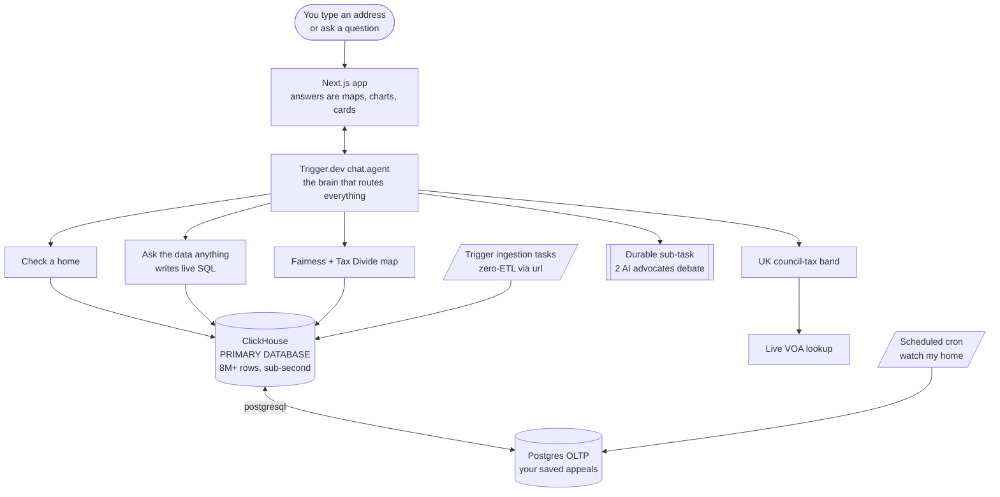

# Overtaxed

**Type your home address and, instead of a paragraph, get a picture: a one-line verdict ("you're overpaying ~$X a year"), a map of your street proving it, and a ready-to-file appeal. You can also just ask the data anything and watch it answer live.**

Built for the **ClickHouse × Trigger.dev Virtual Summer Hackathon 2026**, theme *"Beyond the Wall of Text."*

**Live demo: https://overtaxed-mauve.vercel.app · Video: https://youtu.be/P5RC4348Ssc · Repo: https://github.com/usv240/overtaxed**

> Estimates from public records. Not tax or legal advice.

---

## Highlights (the 10-second version)

- **Every answer is a visual, not text:** a verdict, a street map, comps, a fairness chart, a county heatmap, and a filled-in appeal PDF.
- **Ask the data anything:** the agent writes and runs a safe, read-only **ClickHouse** query live, then charts the result, over 8M rows, with the SQL and latency shown.
- **ClickHouse is the star:** `geoDistance` comps, IAAO PRD/COD fairness, a spatial heatmap (~1,800 cells in ~200ms), a materialized view, `url()` zero-ETL ingestion, and a `postgresql()` OLTP+OLAP federation.
- **Trigger.dev orchestration:** `chat.agent()` + durable ingestion + a durable *for-vs-against* debate sub-task + a scheduled "watch my home" cron.
- **Real, quantified impact:** ~**$460M/yr** measured in Cook County, projected to ~**$20B/yr** nationally (transparent, sourced).
- **Two countries, real data:** US (2 counties) + UK (live VOA), 6M+ UK sales, added with no code changes.
- **Production-grade:** deployed live, unit-tested with CI, MIT-licensed, and honest ("show the maths" on every result).

---

## The problem, in plain words

Most people are overpaying property tax and never find out. In the US, 30 to 60% of homes are valued too high for tax. In the UK, 400,000+ homes sit in the wrong council-tax band (still based on a rushed 1991 valuation). Yet **fewer than 1 in 20 people ever challenge it**, even though winning saves **$1,000 to $3,000 (or £1,000s) a year**.

The prices that prove it are public. The problem is nobody could ever *query* them. Overtaxed makes your street answerable in milliseconds.

**And it's not a small problem.** We *measure* about **$460M a year** of unfair over-assessment in Cook County alone, live, over real homes. Scaled to the country (and matching national research: Avenancio-León & Howard, *The Assessment Gap*, QJE 2022, which studied ~118M homes), that points to roughly **$20 billion a year** shifted onto lower-value homes. Cook County is just one example of a nationwide, systemic bias, and the same pipeline already runs a second US county and the UK with no code changes.

---

## What you can do (every answer is a visual, never a wall of text)

| Ask this | You get back |
|---|---|
| **"Am I overtaxed at `<address>`?"** | A plain-English **verdict** ("you're overpaying ~$3,793/yr"), a **map of your street** with your home glowing red against neighbours, and the **comparable sales** we used. |
| **"Ask the data anything"** (e.g. *"which Chicago areas overpay most for homes under $300k?"*) | The agent **writes a live ClickHouse query itself**, runs it safely, and shows you a **chart + table + the exact SQL it wrote.** |
| **"Show me the Tax Divide map"** | An **explorable heatmap** of over-assessment across the whole county, built from 1.6M real homes, zoom and click any area. |
| **"Is Cook County fair?"** | A fairness study with an **interactive slider** that re-runs the numbers over ClickHouse as you drag it, plus a leaderboard of the most unfair areas. |
| **"Should I appeal?"** | **Two AI advocates debate it** (one for, one against) as a durable background job, then give a verdict. |
| **"File it"** | A **real, filled-in appeal PDF**: a complete Cook County Board of Review complaint with the legal grounds and an evidence grid, ready for review. |
| **"Watch this home"** | One click enrols the home in a **scheduled Trigger.dev task** that re-checks it on a cron and flags it if it becomes more appeal-worthy (a live OLTP write to Postgres). |
| **"Check `<UK postcode>`"** | A **live council-tax band check** against the official VOA, with a 1991 back-check and your council's real Band D charge. |

After every answer, **"Ask next" chips** suggest the natural follow-up, so you're gently guided through everything. All answers are written in **warm, plain English**, no jargon.

---

## How it works (simple architecture)



**In one sentence:** you talk to a **Trigger.dev agent**, it calls tools that query **ClickHouse** (the primary database) live, and the answer comes back as something you can *see and explore*.

---

## Why both tools are essential

### ClickHouse is the primary database and the star

- **Comparable sales** by `geoDistance()`, and the **fairness science** (PRD and COD, the standard IAAO uniformity metrics) computed over 60k+ sold homes, **sub-second**.
- **The Tax Divide heatmap** is one ClickHouse spatial query: `round(lat,2), round(lng,2), count(), avg(ratio)` over 1.6M homes joined to a **materialized view** of latest sales, about **1,800 map tiles in ~200ms**, no external mapping service.
- **Ask the data anything:** the agent turns your question into a **safe, read-only ClickHouse query** (locked to `SELECT` only, with row and time caps) and runs it live. This is the "ask my data anything" idea, on a real civic dataset.
- **Zero-ETL ingestion:** data loads with `INSERT ... SELECT FROM url(...)`, so ClickHouse reads the raw government CSVs straight off the web, no separate loader.
- **OLTP + OLAP in one query:** the `postgresql()` table function joins your saved appeals (Postgres) to the analytics tables (ClickHouse) in a single statement.
- Every answer shows its **query latency**, so the speed is proven on screen, not claimed.

### Trigger.dev is the orchestration layer

- **`chat.agent("overtaxed")`** ([`trigger/chat.ts`](trigger/chat.ts)) runs the whole conversation. Tools return **visual specs**, never prose.
- **Durable, long-running ingestion tasks** ([`trigger/ingest.ts`](trigger/ingest.ts)) stream millions of rows into ClickHouse, retryable, no timeouts.
- **A durable sub-task** ([`trigger/debate.ts`](trigger/debate.ts)): the agent hands the for-vs-against appeal debate to a child task where two Claude advocates argue in parallel, then a verdict.
- **A scheduled (cron) task** ([`trigger/watch.ts`](trigger/watch.ts)) re-checks saved homes and snapshots changes (OLTP to OLAP to OLTP). The **"Watch this home"** button in the UI enrols a home in it with a single click, so the durable, scheduled workflow is something you can actually see and trigger.

---

## Bonus category: best OLTP + OLAP integration

Your saved appeals live in **Postgres (OLTP)**. The analytics live in **ClickHouse (OLAP)** across 8M+ rows. The portfolio page runs **one ClickHouse query** that pulls the Postgres rows via `postgresql()` and joins them against the assessment and sales tables. **One statement, two engines**, with the query and its latency shown right on the page.

---

## The data (all real, all live)

- **US, two counties.** **Cook County** (Chicago): ~1.59M **parcels** (location + address), ~1.59M **assessments**, ~69k arms-length **sales**. **Allegheny County** (Pittsburgh, [WPRDC](https://data.wprdc.org/dataset/property-assessments)): ~456k assessments + ~52k sales. Two counties proves it generalises.
- **UK.** **6.06M** real sales from [HM Land Registry Price Paid](https://www.gov.uk/government/statistical-data-sets/price-paid-data-downloads). Council-tax **bands are fetched live from the VOA** per postcode (no bulk file exists) and cached in ClickHouse; each council's **Band D charge** comes live from gov.uk.
- A handful of statutory reference values (tax rates, 1991 band ranges) are sourced and documented in [`lib/assumptions.ts`](lib/assumptions.ts) and shown at **/methodology**.

---

## Honesty by design

Every number is computed from public records and clearly labelled as an estimate, not advice. Jargon has plain-English tooltips, there's an optional "show the maths" on every result, and the national projection shows its full method and sources at **/methodology**. Nothing is mocked or hardcoded.

---

## The stack

| Layer | Tech |
|---|---|
| Primary database | **ClickHouse Cloud** |
| Orchestration + agent | **Trigger.dev `chat.agent()`** |
| OLTP (bonus) | **Postgres**, federated via `postgresql()` |
| Agent brain | **Claude (Anthropic)** via the AI SDK |
| Frontend | **Next.js · MapLibre GL · Recharts** |
| Appeal PDF | **pdf-lib** |

---

## Run it locally

```bash
cp .env.example .env          # fill in ClickHouse, Postgres, Trigger, Anthropic
npm install
node scripts/apply-sql.mjs db/schema.sql             # ClickHouse tables
node scripts/apply-sql.mjs db/materialized-views.sql # latest_sales materialized view
node scripts/apply-pg.mjs  db/postgres-schema.sql    # Postgres (OLTP) tables
npm test                                              # unit tests
npx trigger.dev@latest dev    # the agent + tasks
npm run dev                   # web app at http://localhost:3000
# then load real data:
node scripts/run-task.mjs ingest-uk-land-registry '{"year":2023}'
node scripts/run-task.mjs ingest-cook-county '{"year":2023}'
node scripts/run-task.mjs ingest-cook-parcels '{"year":2023}'
```

## License

[MIT](LICENSE).
